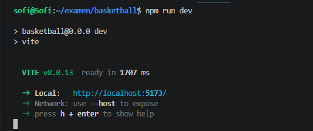
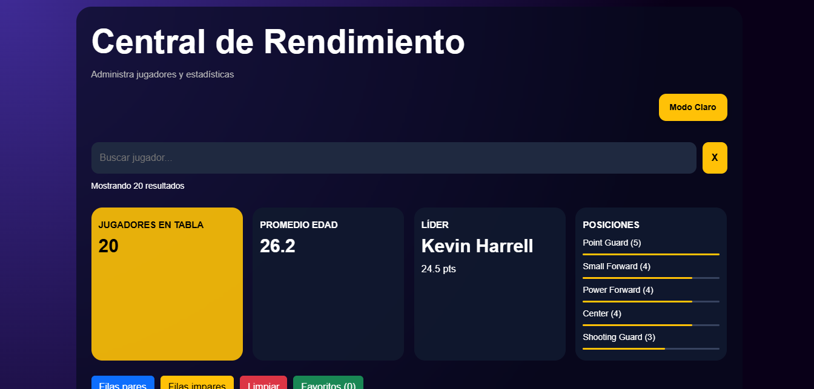
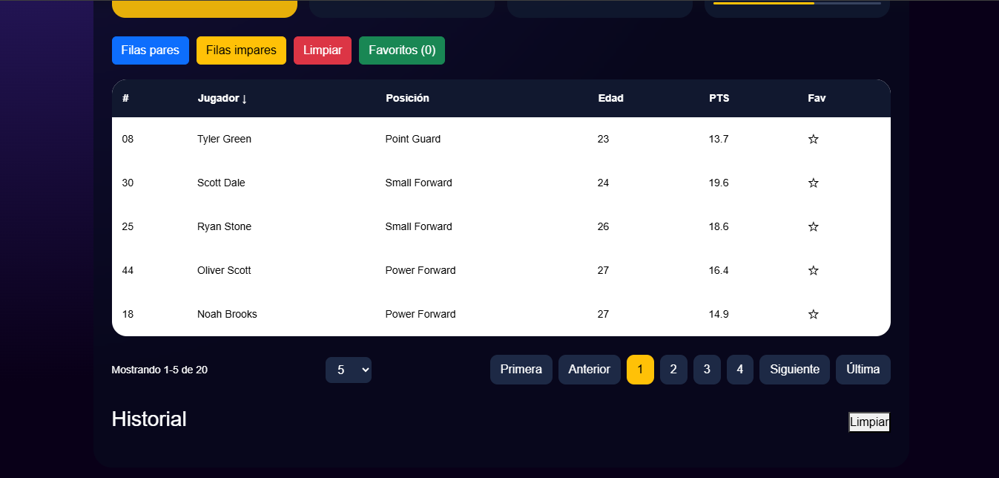
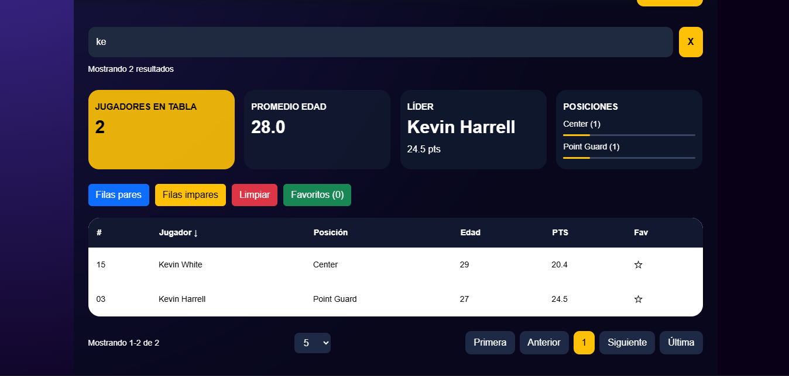
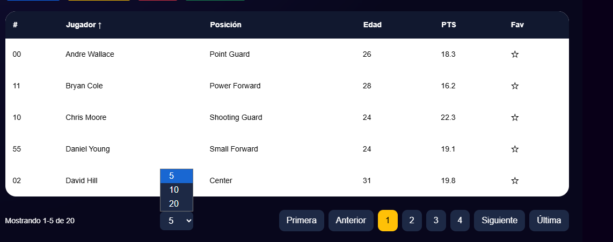
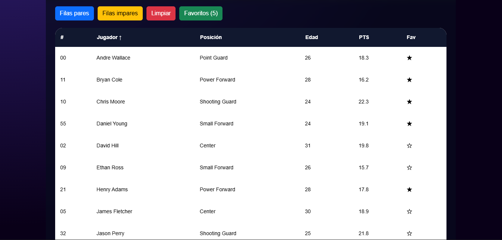
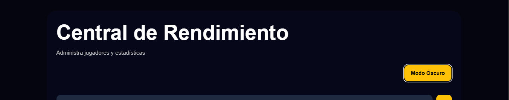
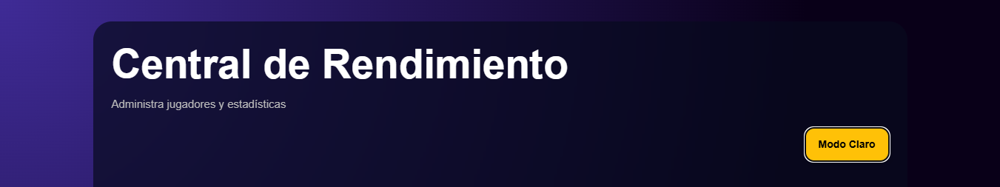
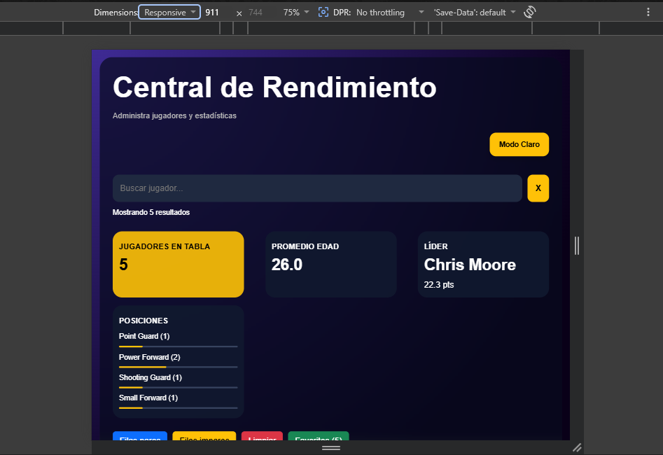

#  Basketball
## Descripción del proyecto

Aplicación desarrollada en React para administrar jugadores de basketball.

El proyecto permite:
- buscar jugadores
- ordenar jugadores
- usar paginación
- guardar favoritos
- visualizar estadísticas
- usar modo oscuro y claro
- abrir un modal con información detallada
- guardar historial de búsquedas

# 👥 Integrantes

- Valentina Vargas
- Sofia Restrepo

# 🤖 IA utilizada

- ChatGPT 
- Gemini

##  2. Instrucciones de Instalación y Despliegue Local

Para clonar, instalar y poner a correr este proyecto en el entorno local, ejecutamos los siguientes comandos:

### Paso A: Clonar el repositorio
```bash
git clone https://github.com/SofiaRestrepoVanegas/proyecto-final

### Paso B: Navegar al directorio del proyecto
Bash
cd examen-basketball-react

### Paso C: Instalar las dependencias del sistema
Bash
npm install

### Paso D: Iniciar el servidor de desarrollo
Bash
npm run dev
```

# 🎣 Lista de Hooks utilizados

## useState

Lo utilizamos para manejar estados dinamicos dentro de la aplicacion.
- Se implemento para:
- busqueda
- favoritos
- paginacion
- historial
- modal
- modo oscuro
- ordenamiento
- colores de filas

Ejemplo:
```jsx
const [favorites, setFavorites] = useState([]);
```
---

## useEffect

Lo utilizamos para manejar efectos secundarios.
Funciones realizadas:
- debounce de busqueda
- guardar informacion en localStorage
- recuperar datos guardados
- actualizar historial
- resetear paginacion

Ejemplo:

```jsx
useEffect(() => {
  localStorage.setItem('favorites',JSON.stringify(favorites) );
}, [favorites]);
```

---

## useMemo

Lo utilizamos para optimizar calculos y evitar renders innecesarios.

Se implemento para:
- total de jugadores
- promedio de edad
- lider anotador
- posiciones

Ejemplo:

```jsx
const stats = useMemo(() => {
  return {
    total: filteredPlayers.length
  };
}, [filteredPlayers]);
```
## 📂 Estructura del Proyecto y Componentes

Aquí explicamos cómo organizamos las carpetas y los archivos que creamos para la aplicación de basketball:

```text
BASKETBALL/
├── public/                  # Imágenes e iconos de la aplicación
├── src/                     # Todo el código del proyecto
│   ├── components/          # Las partes separadas de la interfaz (Componentes)
│   │   ├── Modal/           # Ventana que se abre al dar clic a un jugador
│   │   │   ├── Modal.css
│   │   │   └── Modal.jsx
│   │   ├── Pagination/      # Botones para pasar de página en la tabla
│   │   │   ├── Pagination.css
│   │   │   └── Pagination.jsx
│   │   ├── PlayerRow/       # Una fila individual de la tabla con los datos
│   │   │   ├── PlayerRow.css
│   │   │   └── PlayerRow.jsx
│   │   ├── PlayerTable/     # La tabla completa donde se muestran los jugadores
│   │   │   ├── PlayerTable.css
│   │   │   └── PlayerTable.jsx
│   │   ├── SearchBar/       # El cuadro para buscar y filtrar por nombre
│   │   │   ├── SearchBar.css
│   │   │   └── SearchBar.jsx
│   │   ├── SearchHistory/   # Lista de la ultimas busquedas que se hicieron
│   │   │   ├── SearchHistory.css
│   │   │   └── SearchHistory.jsx
│   │   ├── StatsPanel/      # Los cuadritos de arriba con los promedios totales
│   │   │   ├── StatsPanel.css
│   │   │   └── StatsPanel.jsx
│   │   └── ThemeToggle/     # El botón para cambiar entre modo claro y oscuro
│   │       ├── ThemeToggle.css
│   │       └── ThemeToggle.jsx
│   ├── data/                # Información fija
│   │   └── players.js       # Lista con los datos de los jugadores (puntos, asistencias, etc.)
│   ├── styles/              # Estilos generales
│   │   └── global.css       # Colores y fuentes de toda la página
│   ├── App.css              # Estilos del contenedor principal
│   ├── App.jsx              # Archivo principal que une todos los componentes y los filtros
│   ├── index.css            # Estilos base
│   └── main.jsx             # Lo que hace que React funcione en el navegador
├── .gitignore               # Para que Git ignore la carpeta node_modules
├── APRENDIZAJE.md           # Notas de lo que aprendimos haciendo el proyecto
├── eslint.config.js         # Configuración de reglas del código
├── index.html               # Página HTML base del proyecto
├── package.json             # Lista de cosas instaladas y comandos (npm run dev)
├── README.md                # Este archivo de instrucciones
└── vite.config.js           # Configuración interna de Vite

### 🧩 ¿Qué hace cada parte importante?

* **App.jsx**: Es el archivo principal de la aplicación, aquí guardamos la lista de los jugadores y controlamos los filtros de búsqueda para que todo se encuentre y se actualice en la pantalla.
* **StatsPanel.jsx**: Es el panel de arriba que muestra los totales de puntos, asistencias y rebotes del equipo para que parezca un tablero de estadísticas bien completo.
* **ThemeToggle.jsx**: Es el botón que cambia los colores de la página si el usuario quiere usar el modo oscuro o el modo claro.
* **players.js**: Es donde guardamos los datos de cada jugador en una lista para no tener que escribirlos a mano directamente dentro de la tabla.
```
# 📸 Capturas de pantalla de las funcionalidades principales

## ▶️ Ejecucion del proyecto en la terminal

Se muestra la ejecucion.



### 🏠 Pagina principal

Se muestra vista de la aplicacion 





### 🔎 Sistema de busqueda

Muestra la busqueda dinamica de jugadores en tiempo real.



### 📊 Tabla de jugadores y paginacion

Muestra la tabla interactiva con ordenamiento y paginacion.



### ⭐ Sistema de favoritos

Muestra los jugadores marcados como favoritos.



### 🌙 Cambio de tema

Muetsra el modo oscuro o claro funcionando.






### 📱 Vista responsive

Muetsra la aplicacion en adaptada a celular o pantalla pequeña.


### link al deploy de netlify
para poner la app en línea, conectamos el repositorio de GitHub con Netlify, aqui en este link ya podemos visualizar
https://basketball-proyect.netlify.app/

